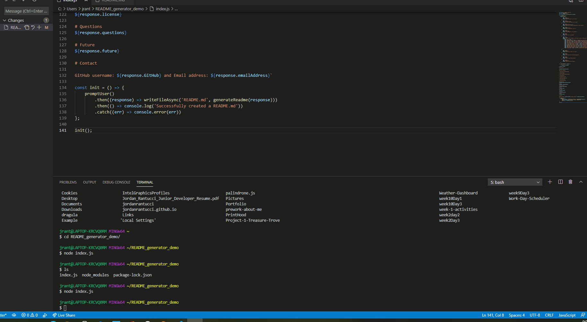

# Professional README Generator

 

## Description 

The project was made using node.js to generate a professional README

## Table of Contents

* [Installation](#installation)

* [Usage](#usage)

* [Contributions](#contributions)

* [Tests](#tests)

* [License](#license)

* [Questions](#questions)

* [Future](#future)

* [Contact](#contact)

## Installation
node.js    

## Usage
The project is used for generating a README

## Contributions
Jordan Rantucci

## Tests
none

## License 
 

# Questions
See Contact Section

# Future
Unknown

# Contact

GitHub username: jordanrantucci and Email address: jordanrantucci@gmail.com
